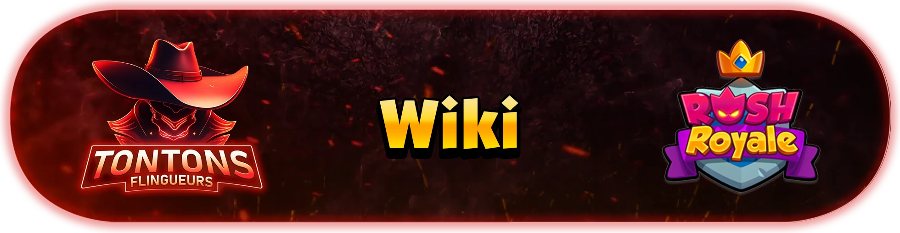

# ttf-wiki

<div align="center">

[](https://github.com/tontonsflingueurs/tontonsflingueurs.github.io/actions) [](https://tontonsflingueurs.github.io/) [](https://github.com/tontonsflingueurs/tontonsflingueurs.github.io/releases)

</div>



## À propos

Wiki communautaire pour **Tontons Flingueurs**, une plateforme collaborative où la communauté partage guides, stratégies et conseils. Le contenu est maintenu par une équipe de rédacteurs et graphistes passionnés.

**🌐 Voir le wiki en ligne : https://tontonsflingueurs.github.io/**

## 🚀 Démarrage rapide

```bash
# Installation
bun install

# Développement
bun dev

# Build production
bun bundle

# Optimiser les images (PNG → WebP)
bun run img:optimize
```

Ouvert sur http://localhost:3000

## 📖 Documentation

- **[Guide de développement](./docs/DEVELOPMENT.md)** - Architecture, structure du projet, configuration
- **[Guide de contribution](./docs/CONTRIBUTING.md)** - Comment contribuer au wiki (2 méthodes)

## ✨ Remerciements

Remerciements dans l'élaboration de ce Wiki :

**Le développeur:**

- Mahzazel

**L'équipe rédactrice:**

- Iokee (iokee)
- Perpi-Lyonnais
- Skykha
- Mahzazel
- Dag

**L'équipe graphique:**

- Zeld
- Phiona
- Thalia
- Pulse

## 🤝 Contribution

Les contributions sont les bienvenues ! Consultez le [guide de contribution](./docs/CONTRIBUTING.md) pour deux approches :

- **Via GitHub Web** : Simple, pas besoin de dev
- **En local** : Pour les développeurs

Toutes les contributions doivent être validées avant acceptation.

## 📜 Licence

Ce projet est sous licence **[CC BY-NC-ND 4.0](LICENSE)** (Attribution - Pas d'Utilisation Commerciale - Pas de Modification sans validation).
